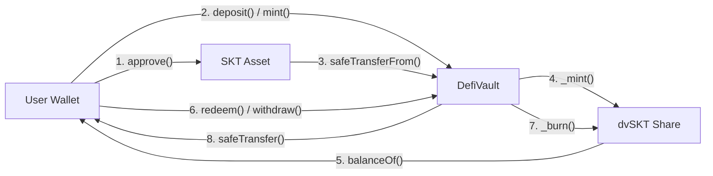
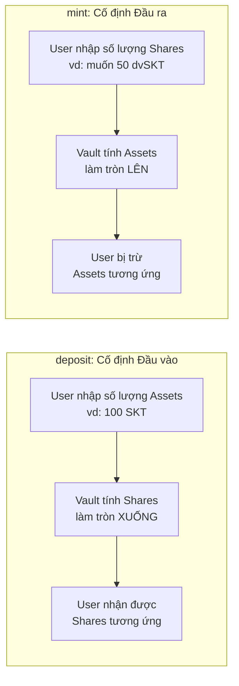
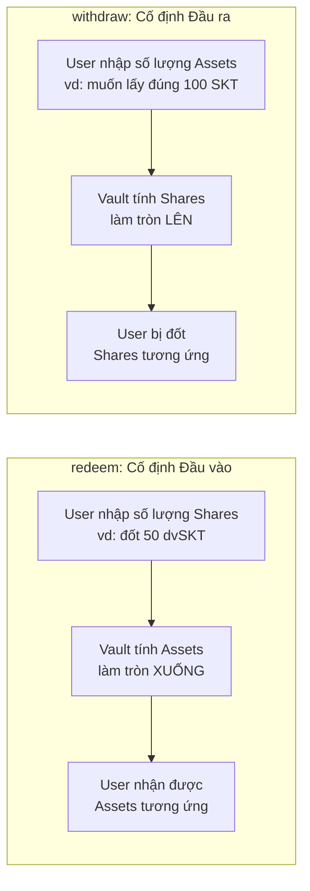
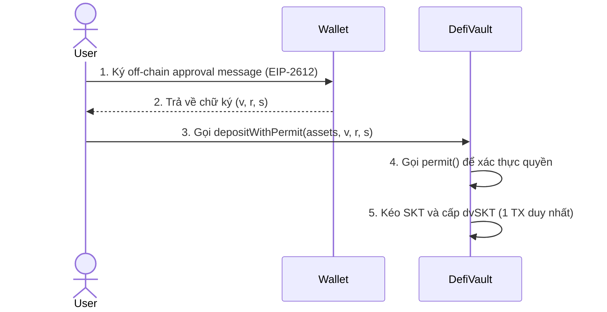
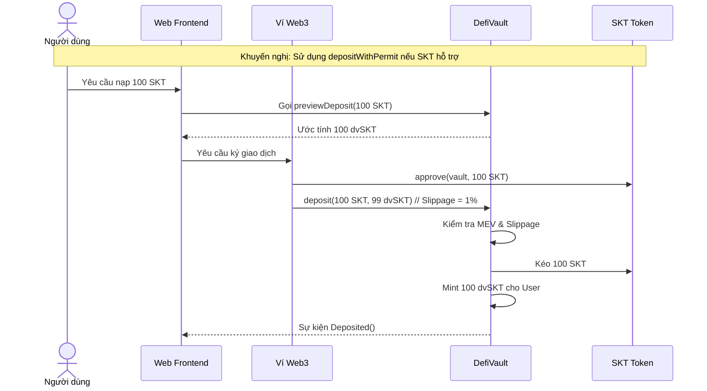

# Tài liệu nghiệp vụ Defi Vault (Cập nhật Hậu Refactor ERC4626)

**Đề tài:** Nghiên cứu các giao thức DeFi trên Blockchain và phát triển ứng dụng WebDefi thử nghiệm trên Ethereum Sepolia  
**Phạm vi:** Phân tích nghiệp vụ, công thức, luồng hoạt động và bảo mật của `DefiVault` trong thư mục `blockchain`  
**Ngày cập nhật:** 2026-05-03

## 1. Mục tiêu tài liệu

Tài liệu này cung cấp góc nhìn toàn diện về nghiệp vụ và kỹ thuật on-chain của `DefiVault` sau đợt tái cấu trúc (refactor) lớn. Mã nguồn tham chiếu:

- `blockchain/contracts/DefiVault.sol`
- `blockchain/contracts/interfaces/IDefiVault.sol`
- `blockchain/test/shared/DefiVault.fixture.ts`
- `blockchain/test/DefiVault.*.test.ts` (Core, ERC4626, Security, EdgeCases)

Khác với phiên bản sơ khai, `DefiVault` hiện tại **đạt chuẩn 100% ERC-4626 (Tokenized Vaults)**. Nó bao gồm đầy đủ 4 hàm cốt lõi (`deposit`, `mint`, `withdraw`, `redeem`), tuân thủ khắt khe các quy tắc làm tròn (Rounding Floor/Ceil) và được trang bị các cơ chế bảo mật cấp doanh nghiệp.

## 2. Bối cảnh nghiên cứu DeFi

Trong DeFi, vault là mô hình gom tài sản của nhiều người dùng vào một hợp đồng thông minh. Mỗi người dùng nắm giữ **share token** (cổ phần) thể hiện tỷ lệ sở hữu trên tổng tài sản vault. 

`DefiVault` đóng vai trò module minh họa nhóm nghiệp vụ:
- Giao tiếp chuẩn hóa: Tuân thủ EIP-4626 giúp vault dễ dàng tích hợp với các aggregator, router và protocol khác.
- Share accounting: Quản lý chính xác quyền sở hữu với bảo vệ lạm phát.
- Security & MEV: Chống Flash Loan Sandwich attack và trượt giá (Slippage).
- Tích hợp Yield (Strategy-Based Vault): Đã kết nối thành công với `StakingStrategyController` để tự động hóa việc staking và phân bổ lợi nhuận.

## 3. Định nghĩa cơ bản theo chuẩn ERC-4626

| Thuật ngữ | Ý nghĩa trong hệ thống DefiVault |
| --- | --- |
| Underlying asset | Tài sản gốc (`SKT`). `asset()` trả về địa chỉ của nó. |
| Share token | Token đại diện sở hữu (`dvSKT`). `DefiVault` tự phát hành (ERC-20). |
| Total Assets | `totalAssets() = SKT.balanceOf(address(this))` |
| Deposit | Nạp `X assets` để nhận về `Y shares` (Vault tính `Y`). Làm tròn xuống (Floor). |
| Mint | Muốn nhận chính xác `Y shares`, nạp vào `X assets` (Vault tính `X`). Làm tròn lên (Ceil). |
| Redeem | Đốt `Y shares` để nhận về `X assets` (Vault tính `X`). Làm tròn xuống (Floor). |
| Withdraw | Muốn rút chính xác `X assets`, cần đốt `Y shares` (Vault tính `Y`). Làm tròn lên (Ceil). |
| Preview Functions | Tính toán on-chain (mô phỏng) không thay đổi state (`previewDeposit`, `previewMint`, v.v.) |
| Virtual Offset | Tài sản/share ảo (10^18) thêm vào công thức để chặn Inflation Attack. |

## 4. Tổng quan kiến trúc on-chain

### 4.1 Thành phần chính

| Thành phần | Vai trò |
| --- | --- |
| `DefiVault.sol` | Smart Contract chính (Kế thừa ERC20, ReentrancyGuard, Pausable, Ownable). |
| `IDefiVault.sol` | Interface chứa các hàm chuẩn ERC4626 và các hàm mở rộng (bảo vệ slippage, permit). |
| Test Suite | 4 file test chuyên biệt: Core, ERC4626, Security, EdgeCases (44/44 tests passed). |

### 4.2 Sơ đồ Dòng Tiền (Asset Flow)



## 5. Nghiệp vụ chi tiết: 4 Entry Points

Vault cung cấp 4 phương thức tương tác chính, phân chia theo việc người dùng muốn kiểm soát "đầu vào" hay "đầu ra". Mọi hàm đều có phiên bản chống trượt giá (Slippage Protection).

### 5.1 Nạp tiền: `deposit` vs `mint`



**`deposit(uint256 assets, uint256 minShares)`**
- Người dùng có `100 SKT`, muốn nạp toàn bộ.
- Vault tính toán số `dvSKT` sẽ trả về (ví dụ: `99 dvSKT`). Lượng trả về luôn được **làm tròn xuống (Floor)** để bảo vệ vault.
- Revert nếu `shares < minShares` (Chống trượt giá).

**`mint(uint256 shares, uint256 maxAssets)`**
- Người dùng cần chính xác `50 dvSKT`.
- Vault tính toán số `SKT` cần kéo từ ví (ví dụ: `51 SKT`). Lượng yêu cầu luôn được **làm tròn lên (Ceil)** để đảm bảo user trả đủ.
- Revert nếu `assets > maxAssets`.

### 5.2 Rút tiền: `redeem` vs `withdraw`



**`redeem(uint256 shares, uint256 minAssets)`**
- Người dùng có `50 dvSKT`, muốn rút toàn bộ.
- Vault tính toán số `SKT` sẽ trả về. Lượng trả về được **làm tròn xuống (Floor)**.
- Revert nếu `assets < minAssets`.

**`withdraw(uint256 assets, uint256 maxShares)`**
- Người dùng cần lấy đúng `100 SKT` để xài.
- Vault tính toán số `dvSKT` cần đốt. Lượng share cần đốt được **làm tròn lên (Ceil)**.
- Revert nếu `shares > maxShares` hoặc user không đủ share.

### 5.3 Nạp tiền không tốn phí duyệt: `depositWithPermit`


Sử dụng chữ ký EIP-2612. Người dùng chỉ cần ký một off-chain message, sau đó đẩy lên blockchain và thực hiện nạp tiền trong cùng 1 giao dịch, tiết kiệm thao tác `approve`.

## 6. Sơ đồ tuần tự: Tích hợp Frontend



## 7. Công thức và Quy tắc Làm tròn (Rounding Rules)

Sự sống còn của Vault nằm ở việc không bao giờ làm tròn có lợi cho user, nếu không kẻ tấn công có thể bòn rút (drain) tài sản thông qua sai số (dust exploits).

### 7.1 Công thức Quy đổi (Virtual Offset)

```text
shares = assets * (totalSupply + 10^18) / (totalAssets + 10^18)
assets = shares * (totalAssets + 10^18) / (totalSupply + 10^18)
```
Việc thêm `10^18` (Virtual Shares) vô hiệu hóa hoàn toàn **Inflation Attack**. Kẻ tấn công không thể quyên góp một khoản tiền khổng lồ vào vault rỗng để đẩy giá share lên quá cao, bởi vì mẫu số luôn bị pha loãng bởi `10^18`.

### 7.2 ERC4626 Rounding Matrix

| Thao tác | Đầu vào user cấp | Tính toán đầu ra | Quy tắc làm tròn | Ý nghĩa bảo mật |
| --- | --- | --- | --- | --- |
| **Deposit** | `assets` (vào) | `shares` (nhận) | **Floor** (Xuống) | User nhận ít shares hơn thực tế (dust giữ lại vault). |
| **Mint** | `shares` (nhận) | `assets` (vào) | **Ceil** (Lên) | User phải trả nhiều assets hơn thực tế. |
| **Redeem** | `shares` (đốt) | `assets` (nhận) | **Floor** (Xuống) | User nhận ít assets hơn thực tế. |
| **Withdraw** | `assets` (nhận) | `shares` (đốt) | **Ceil** (Lên) | User phải đốt nhiều shares hơn thực tế. |

## 8. Đánh giá Bảo mật & Rủi ro (Đạt chuẩn)

Trong bản cập nhật gần nhất, `DefiVault` đã vượt qua 44/44 test cases cực kỳ khắt khe, che phủ toàn bộ các mảng rủi ro:

1. **Flash Loan Sandwich / MEV Guard:** 
   - Kỹ thuật: Bất kỳ address nào vừa nạp tiền (deposit/mint) sẽ bị lưu lại `block.number`.
   - Kết quả: Không thể gọi `redeem/withdraw` trong cùng một block. Chặn đứng hoàn toàn tấn công Flash Loan.
2. **Reentrancy Guard:** 
   - Modifier `nonReentrant` trên toàn bộ luồng đổi state.
3. **Pausable & Ownable:**
   - Admin có quyền đóng băng (Pause) nạp/rút trong tình huống khẩn cấp (Black Swan).
   - Hàm `emergencyWithdraw` chỉ kích hoạt khi Paused, cho phép cứu tài sản về ví admin.
4. **Slippage Protection:**
   - Các tham số `min/max` bắt buộc tx revert nếu MEV bot thao túng tỷ giá trước khi tx được mine.

## 9. Phân bổ Yield (Lợi nhuận) thông qua Strategy

Hiện tại, `DefiVault` đã được tích hợp với hợp đồng `Staking.sol` (Strategy Module) để trở thành một Vault sinh lời tự động (Yield-Generating):
- **Cơ chế Realized Gain:** Lợi nhuận từ quá trình staking được đưa trở lại Vault thông qua hàm `harvest()` (cơ chế donation).
- **Tăng trưởng tỷ giá:** Khi Vault nhận được lợi nhuận (Ví dụ: `totalAssets` tăng từ 100 lên 120, nhưng `totalSupply` vẫn là 100), tỷ giá `pricePerShare` của mỗi `dvSKT` tự động tăng lên 1.2 SKT.
- **Rút vốn và Lãi:** Bất kỳ ai gọi `redeem` hoặc `withdraw` sẽ nhận được phần vốn gốc cộng với lợi nhuận tỷ lệ thuận với số lượng Share đang nắm giữ tại thời điểm rút.

## 10. Hướng triển khai tiếp theo

Sau khi nền móng ERC4626 đã vững chắc và hoàn tất tích hợp kiến trúc Strategy-Vault, mục tiêu tiếp theo cho WebDefi Sepolia là:
1. **Triển khai Testnet:** Sử dụng Hardhat Ignition để deploy toàn bộ cụm Smart Contract (`DefiVault` + `Staking.sol` + `Token`) lên mạng Sepolia Testnet.
2. **Kiểm thử Thực tế (Smoke Testing):** Thực hiện các kịch bản nạp, rút, stake, và harvest thực tế trên mạng để đảm bảo tính ổn định và tính toán gas thực tế.
3. **Tích hợp Frontend:** Nâng cấp Web Frontend để người dùng có thể tương tác với `DefiVault` (hiển thị APY, quản lý danh mục đầu tư).

## 11. Tài liệu tham khảo chính thống

1. **EIP-4626: Tokenized Vaults**: https://eips.ethereum.org/EIPS/eip-4626
2. **OpenZeppelin ERC4626 & Inflation Attack**: https://docs.openzeppelin.com/contracts/4.x/erc4626
3. **EIP-2612: permit – 712-signed approvals**: https://eips.ethereum.org/EIPS/eip-2612
