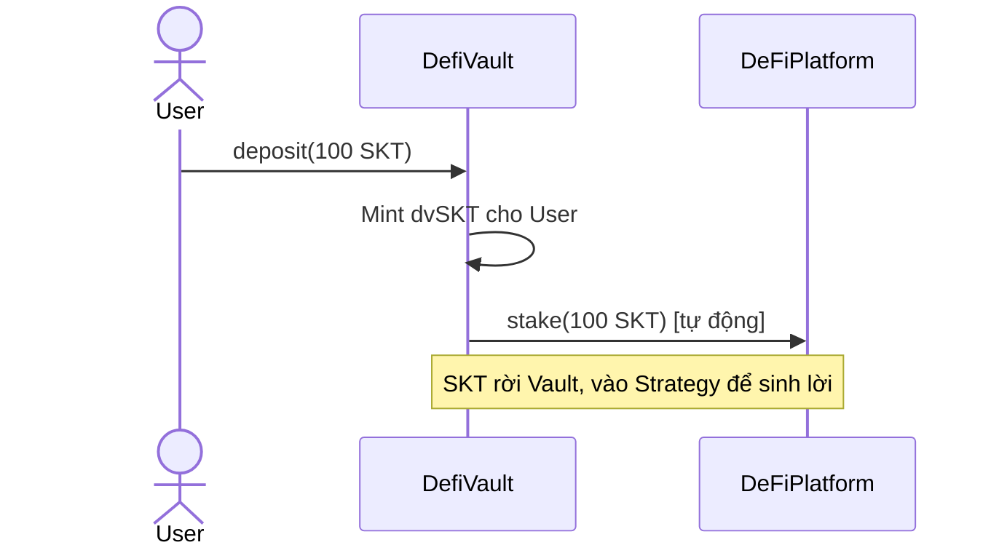
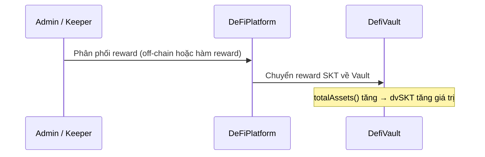
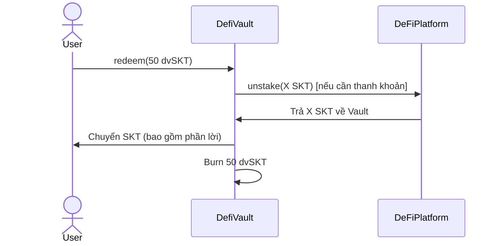

# Phương hướng tích hợp DeFiStaking → DefiVault (Yield-Generating Vault)

**Đề tài:** Nghiên cứu các giao thức DeFi trên Blockchain và phát triển ứng dụng WebDefi thử nghiệm trên Ethereum Sepolia  
**Phạm vi:** Thiết kế kiến trúc tích hợp giữa `DeFiPlatform` (Staking) và `DefiVault` (ERC4626 Vault)  
**Ngày viết:** 2026-05-03  
**Trạng thái:** Kế hoạch — Bước 2 (Sau khi hoàn thành ERC4626 Compliance)

---

## 1. Bối cảnh & Mục tiêu

### 1.1 Hiện trạng sau Bước 1

Sau đợt refactor lớn (Bước 1), `DefiVault` đã đạt **100% ERC4626 Compliance** với:

- ✅ 4 hàm core: `deposit`, `mint`, `redeem`, `withdraw`
- ✅ Bảo mật Grade A: Virtual Shares, MEV Guard, Reentrancy, Pausable
- ✅ Slippage Protection trên tất cả entry points
- ✅ 44/44 test cases PASS

Tuy nhiên, tài sản người dùng gửi vào Vault **đang nằm im** — không sinh lời. Đây là một "két sắt" thụ động, chưa phải Yield Vault đúng nghĩa.

### 1.2 Mục tiêu Bước 2

Biến `DefiVault` từ **"Custodial Vault" (giữ hộ)** thành **"Yield-Generating Vault" (sinh lời tự động)** bằng cách sử dụng `DeFiPlatform` (staking contract hiện có) làm **Strategy** — nguồn sinh lợi nhuận.

> **Nguyên lý cốt lõi:** Bất kỳ sự gia tăng nào trong `totalAssets()` của Vault đều tự động làm tăng giá trị mỗi `dvSKT`. Không cần thay đổi share accounting — chỉ cần đưa tài sản đi làm việc.

---

## 2. Phân tích các thành phần hiện có

### 2.1 DefiVault (Vault — Bước 1 hoàn thành)

| Đặc điểm | Chi tiết |
| --- | --- |
| Vai trò hiện tại | Nhận `SKT` từ user, phát hành `dvSKT` (share token) |
| Nguồn `totalAssets` | `SKT.balanceOf(address(DefiVault))` |
| Cơ chế sinh lời | Chưa có — idle assets |
| Điểm mạnh | Chuẩn ERC4626 đầy đủ, bảo mật cao |
| Điểm cần bổ sung | Logic điều phối tài sản sang Strategy |

### 2.2 DeFiPlatform (Staking — Strategy)

| Đặc điểm | Chi tiết |
| --- | --- |
| Vai trò | Nhận `SKT` stake, lưu số dư theo từng địa chỉ |
| Hàm chính | `stake(amount)`, `unstake(amount)` |
| Theo dõi | `stakeBalance[address]`, `totalStaked`, `lastStakeTime[address]` |
| Bảo mật | `nonReentrant`, `Pausable`, `Ownable` |
| Điểm cần lưu ý | Hiện chưa có cơ chế phát reward tự động — cần bổ sung hoặc kết hợp phát reward off-chain |

---

## 3. Phương hướng tích hợp đề xuất

### 3.1 Mô hình kiến trúc: "Vault → Strategy"

```
User ──deposit SKT──▶ DefiVault
                          │
                          ▼ (auto-stake idle assets)
                     DeFiPlatform (Staking Strategy)
                          │
                          ▼ (yield/reward về lại Vault)
                     DefiVault.totalAssets() tăng
                          │
                          ▼
           dvSKT tăng giá trị theo tỷ lệ share
```

Trong mô hình này:
- **`DefiVault`** đóng vai trò **Orchestrator (điều phối)** — nhận tiền từ user, phân bổ cho Strategy.
- **`DeFiPlatform`** đóng vai trò **Strategy (chiến lược)** — nơi tài sản thực sự làm việc để sinh lời.
- **Người dùng** chỉ cần tương tác với `DefiVault` — hoàn toàn không cần biết bên trong có Strategy.

---

### 3.2 Luồng nghiệp vụ chi tiết

#### A. Luồng Deposit (User → Vault → Strategy)



1. User gọi `deposit(100 SKT)` vào `DefiVault`.
2. Vault mint `dvSKT` cho User theo tỷ giá hiện tại.
3. Vault **tự động gọi** `stake()` trên `DeFiPlatform` để gửi toàn bộ (hoặc một phần) SKT vào Strategy.
4. Tài sản bắt đầu sinh lời trong DeFiPlatform.

> **Lưu ý:** Sau bước 3, `SKT.balanceOf(DefiVault)` sẽ gần bằng 0 — tài sản đã nằm trong Strategy. Do đó `totalAssets()` cần được cập nhật để phản ánh cả số dư tại Strategy (xem Mục 4).

#### B. Luồng Harvest (Thu hoạch lợi nhuận)



1. Định kỳ (hoặc do sự kiện), reward `SKT` được chuyển về địa chỉ `DefiVault`.
2. `totalAssets()` của Vault tăng lên.
3. Mỗi `dvSKT` tự động có giá trị cao hơn — không cần tác động gì thêm.

#### C. Luồng Redeem (User → Vault → Unstake từ Strategy)



1. User gọi `redeem(50 dvSKT)`.
2. Vault tính ra số `SKT` cần trả theo tỷ giá hiện tại (đã bao gồm yield).
3. Nếu Vault không đủ `SKT` trong số dư trực tiếp → gọi `unstake()` từ Strategy để lấy về.
4. Trả `SKT` cho User, burn `dvSKT`.

---

## 4. Các vấn đề kỹ thuật cần giải quyết

### 4.1 Cập nhật `totalAssets()` — Vấn đề cốt lõi

**Vấn đề:** Khi Vault đã stake toàn bộ SKT vào Strategy, `SKT.balanceOf(DefiVault) ≈ 0`. Nếu giữ nguyên logic cũ, `totalAssets()` sẽ báo sai, làm share price giảm về 0 — một thảm họa.

**Giải pháp:** `totalAssets()` phải được tính bằng tổng của:
- Số dư SKT trực tiếp tại Vault (`SKT.balanceOf(DefiVault)`)
- **Cộng** số dư SKT đang stake tại Strategy (`DeFiPlatform.stakeBalance(DefiVault)`)
- **Cộng** reward tích lũy chưa thu hoạch (nếu Strategy hỗ trợ)

### 4.2 Chiến lược quản lý thanh khoản (Liquidity Buffer)

**Vấn đề:** Nếu Vault stake 100% vào Strategy, khi User muốn rút ngay, Vault phải `unstake` → làm phát sinh thêm giao dịch và có thể bị chậm.

**Giải pháp:** Duy trì một **Liquidity Buffer** — ví dụ 10% tổng tài sản luôn giữ tại Vault để phục vụ các lệnh rút nhỏ tức thời. Chỉ 90% còn lại được stake vào Strategy.

| Tỷ lệ | Vị trí | Mục đích |
| --- | --- | --- |
| 90% | DeFiPlatform | Sinh lời (APY) |
| 10% | DefiVault (giữ trực tiếp) | Thanh khoản tức thời |

### 4.3 Cơ chế phân phối Reward

**Vấn đề hiện tại:** `DeFiPlatform` hiện tại **chưa có cơ chế phát reward tự động** (APY). Nó chỉ ghi nhận `stakeBalance` và `totalStaked`.

**Các phương án:**

| Phương án | Mô tả | Độ phức tạp |
| --- | --- | --- |
| **A — Owner Inject Reward** | Admin định kỳ chuyển một lượng SKT vào Vault (mô phỏng reward). Đơn giản nhất cho testnet/nghiên cứu. | Thấp |
| **B — Tích hợp Reward Contract** | Bổ sung hàm `calculateReward(address, duration)` vào DeFiPlatform theo mô hình APY thực sự. | Trung bình |
| **C — Two-Token Reward** | DeFiPlatform phát token reward khác (ví dụ: `RWD`), Vault dùng SimpleAMM để đổi `RWD → SKT` rồi cộng vào pool. | Cao |

**Khuyến nghị cho Sepolia Testnet (Nghiên cứu):** Bắt đầu với **Phương án A** để minh họa cơ chế, sau đó nâng lên **Phương án B** để tạo Yield tự động.

### 4.4 Quyền hạn: Vault phải là "operator" của Strategy

`DeFiPlatform` yêu cầu caller phải `approve` trước khi stake. Vault cần được cấp quyền để thay mặt người dùng gọi `stake()`:
- Vault cần `approve(DeFiPlatform, type(uint256).max)` khi khởi tạo.
- Hoặc approve từng lượng trước mỗi lần stake.

---

## 5. Đánh giá Rủi ro Tích hợp

| Rủi ro | Khả năng | Tác động | Biện pháp giảm thiểu |
| --- | --- | --- | --- |
| **Strategy bị hack/pause** | Trung bình | Cao — User không rút được | Vault vẫn giữ Liquidity Buffer 10%; Admin có thể Emergency Withdraw |
| **totalAssets() báo sai** | Thấp (nếu implement đúng) | Rất cao — Share price bị sai | Test kỹ invariant: `totalAssets == vaultBalance + strategyBalance` |
| **Reentrancy qua Strategy** | Thấp | Cao | Vault vẫn dùng `nonReentrant`; CEI pattern được giữ nguyên |
| **Reward token không đủ** | Trung bình | Thấp — Vault vẫn hoạt động, APY = 0 | Giám sát reward pool; thông báo rõ cho user |
| **Unstake bị delay** | Thấp (testnet) | Trung bình | Liquidity Buffer phục vụ rút nhỏ; rút lớn chờ unstake |

---

## 6. Lộ trình thực hiện (Roadmap)

### Giai đoạn 1 — Nền móng (Ưu tiên cao 🔴)

1. **Nâng cấp `totalAssets()`** trong `DefiVault`: Bao gồm cả số dư tại Strategy.
2. **Thêm hàm `_deployToStrategy()`**: Logic nội bộ tự động stake idle assets sau mỗi lần deposit.
3. **Thêm hàm `_retrieveFromStrategy(uint256 amount)`**: Gọi unstake khi cần thanh khoản cho user redeem.
4. **Cập nhật interface `IDefiVault`**: Thêm các event mới (`StrategyDeployed`, `StrategyRetrieved`, `YieldHarvested`).

### Giai đoạn 2 — Yield Mechanism (Ưu tiên trung bình 🟡)

5. **Bổ sung APY vào `DeFiPlatform`**: Thêm hàm `pendingReward(address)` và `claimReward()` dựa trên thời gian stake.
6. **Thêm hàm `harvest()`** trong `DefiVault`: Vault tự gọi `claimReward()` từ Strategy và cộng phần thưởng vào pool → làm tăng `totalAssets()`.
7. **Kiểm soát Liquidity Buffer**: Định nghĩa tỷ lệ phân bổ (ví dụ: 90/10) và tự động tái cân bằng.

### Giai đoạn 3 — Kiểm thử & Hoàn thiện (Ưu tiên cao 🔴)

8. **Viết Integration Tests**: Test end-to-end toàn bộ luồng `Deposit → Auto-Stake → Harvest → Redeem`.
9. **Invariant Tests**: Kiểm tra `totalAssets() >= sum(convertToAssets(shareOf(user)))` luôn đúng.
10. **Cập nhật tài liệu**: Cập nhật `defi-vault-business-document.md` và `IDefiVault.sol`.

---

## 7. So sánh trước và sau tích hợp

| Tiêu chí | DefiVault (Bước 1 — Hiện tại) | DefiVault + Strategy (Bước 2) |
| --- | --- | --- |
| **Chuẩn ERC4626** | ✅ 100% | ✅ 100% (giữ nguyên) |
| **Bảo mật** | Grade A | Grade A (mở rộng cho Strategy risk) |
| **Yield thực tế** | ❌ 0% APY | ✅ APY từ DeFiPlatform |
| **User Experience** | Gửi tiền, để không | Gửi tiền, tự động sinh lời |
| **Độ phức tạp** | Trung bình | Cao hơn (cần quản lý Strategy + Liquidity) |
| **Phù hợp nghiên cứu** | ✅ Tốt | ✅ Rất tốt — minh họa toàn diện DeFi composability |

---

## 8. Nguyên tắc thiết kế cần tuân thủ

Dù ở giai đoạn nào, thiết kế phải giữ vững các nguyên tắc:

1. **Vault không bao giờ mất tiền do lỗi kế toán:** `totalAssets()` phải luôn phản ánh đúng tổng tài sản thực tế, kể cả phần đang nằm tại Strategy.
2. **Share price chỉ tăng, không giảm** (trong điều kiện bình thường): Mỗi lần harvest reward phải làm `totalAssets` tăng mà không phát sinh shares mới.
3. **CEI Pattern không bao giờ bị vi phạm:** Vault gọi Strategy chỉ ở bước "Interaction" — sau khi đã update state nội bộ.
4. **Strategy failure không được làm Vault sập:** Vault vẫn phải cho phép user rút tài sản từ Liquidity Buffer ngay cả khi Strategy bị pause.
5. **Minh bạch với người dùng:** Frontend luôn hiển thị được `currentAPY`, `totalAssetsInStrategy`, `liquidityBuffer`.

---

## 9. Tài liệu tham khảo

1. **EIP-4626: Tokenized Vaults**: https://eips.ethereum.org/EIPS/eip-4626
2. **Yearn Finance — Strategy Pattern**: https://docs.yearn.fi/developers/v2/ARCHITECTURE
3. **OpenZeppelin — ERC4626 Implementation Notes**: https://docs.openzeppelin.com/contracts/4.x/erc4626
4. **Solidity Docs — Security Considerations**: https://docs.soliditylang.org/en/latest/security-considerations.html
