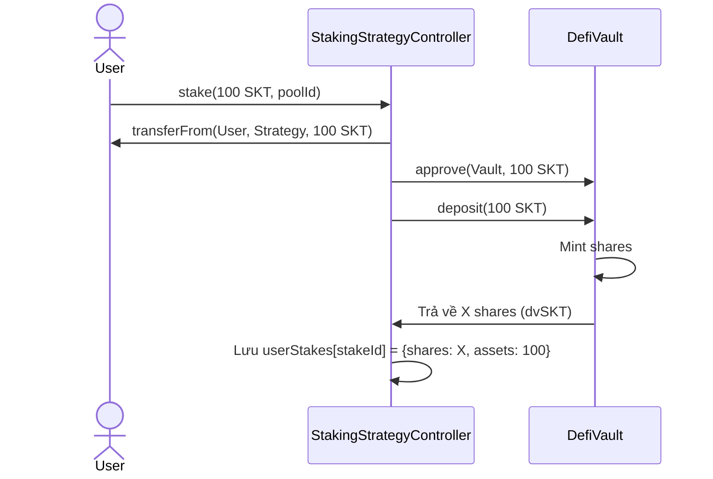
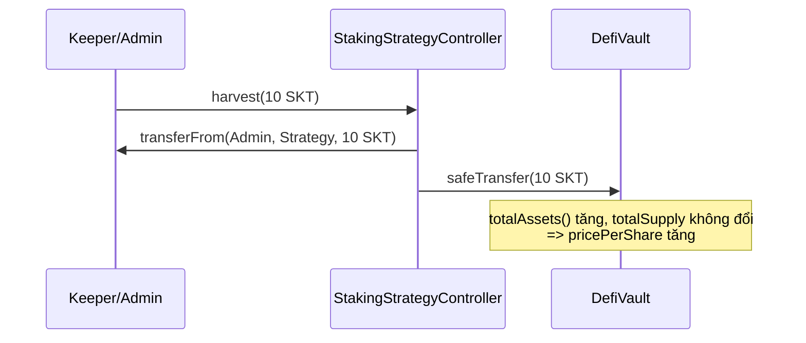
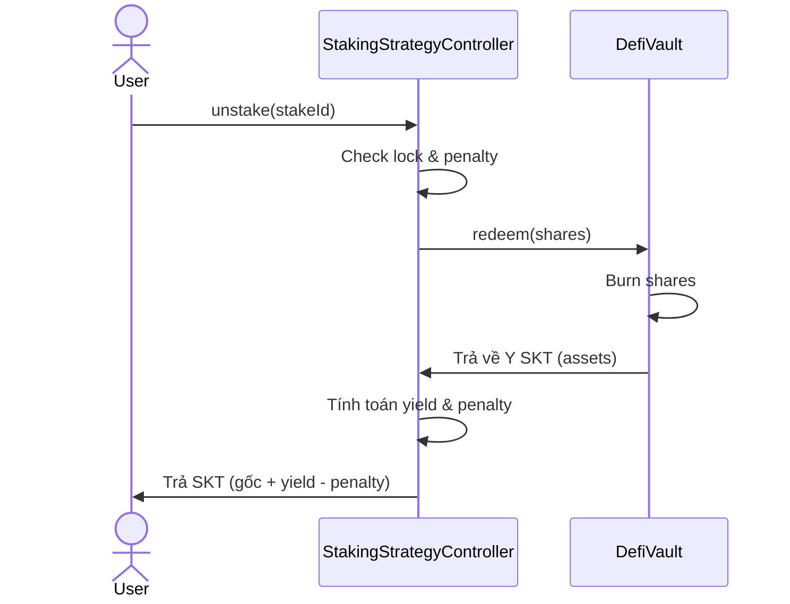

# Phương hướng tích hợp StakingStrategyController → DefiVault (ERC4626)

**Đề tài:** Nghiên cứu các giao thức DeFi trên Blockchain và phát triển ứng dụng WebDefi thử nghiệm trên Ethereum Sepolia  
**Phạm vi:** Tài liệu kiến trúc và luồng tích hợp giữa `StakingStrategyController` (Strategy) và `DefiVault` (ERC4626 Vault)  
**Trạng thái:** Đã hoàn thành (Phase 5)

---

## 1. Bối cảnh & Mục tiêu

Sau khi hoàn thiện `DefiVault` đạt chuẩn ERC4626, bài toán đặt ra là chuyển đổi mô hình Staking cũ (`WalletStaking` - trả lãi cố định APR, tĩnh) sang một mô hình sinh lời thực tế (Dynamic Yield).
Mục tiêu: Xây dựng một **Strategy Controller** kết nối với **DefiVault**, trong đó:
- **Vault** quản lý `shares` (chứng nhận cổ phần) và tài sản tổng.
- **Strategy** xử lý logic stake/unstake, thời gian khóa (lock duration), và penalty của người dùng.
- Yield (lợi nhuận) được tạo ra thông qua cơ chế `harvest()` (tiêm lợi nhuận vào Vault, làm tăng `pricePerShare`).

---

## 2. Mô hình kiến trúc: "Strategy → Vault"

```text
User ── stake(SKT) ──▶ StakingStrategyController (Strategy)
                                │
                                ▼ (deposit)
                           DefiVault (ERC4626)
                                │
                                ▼
                       Strategy nhận dvSKT (Shares)
```

Trong mô hình này:
- **`DefiVault`**: Nắm giữ tài sản thực tế và quản lý tỷ giá `pricePerShare`. Không quan tâm đến thời hạn hay penalty (Core Accounting).
- **`StakingStrategyController`**: Đóng vai trò là **Strategy**. Nó nhận SKT từ User, gọi `vault.deposit()` để gửi vào Vault, sau đó lưu lại `shares` cho mỗi User thay vì lưu balance tĩnh.
- **Người dùng**: Tương tác trực tiếp với Strategy để Stake/Unstake.

---

## 3. Luồng nghiệp vụ chi tiết

### A. Luồng Stake (User → Strategy → Vault)



1. User gọi `stake(100 SKT)` vào `Strategy`.
2. Strategy nhận tiền từ User, cấp quyền (approve) cho Vault.
3. Strategy gọi `deposit(100)` vào `DefiVault`.
4. Vault mint `shares` (dvSKT) trả về cho Strategy.
5. Strategy ghi nhận số `shares` này vào vị thế (position) của User.

### B. Luồng Harvest (Sinh lời tự động)



1. Admin/Keeper (đóng vai trò nguồn tạo ra yield) gọi `harvest(rewardAmount)` trên `Strategy`.
2. Token được đẩy **trực tiếp** vào địa chỉ của `DefiVault` thông qua `transfer()`.
3. Hành động này là **Donation** (Realized Gain). Nó làm tăng `totalAssets()` của Vault nhưng **không mint thêm shares**.
4. Kết quả: Tất cả các `shares` đang tồn tại (của stakers) đều tự động tăng giá trị quy đổi sang SKT.

### C. Luồng Unstake (User → Strategy → Vault)



1. User gọi `unstake(stakeId)` trên `Strategy`.
2. Strategy kiểm tra `shares` tương ứng của vị thế.
3. Strategy gọi `vault.redeem(shares)` để rút tài sản từ Vault. Do `pricePerShare` đã tăng nhờ quá trình Harvest, tài sản thu về (Y) sẽ lớn hơn hoặc bằng gốc ban đầu (100).
4. Strategy tính yield: `Y - 100`.
5. Strategy tính penalty (nếu rút sớm) dựa trên gốc ban đầu.
6. Strategy chuyển tài sản cuối cùng về cho User.

---

## 4. Các giải pháp Kỹ thuật và Bảo mật

### 4.1 State Management (Shares vs Assets)
Strategy **không lưu** số lượng assets sinh lời hiện tại của người dùng. Nó chỉ lưu `shares` và `assetsAtStake` (gốc snapshot ban đầu). Giá trị thực tế của vị thế được tính toán động (dynamic) bằng cách gọi `vault.previewRedeem(shares)`.

### 4.2 CEI Pattern & ReentrancyGuard
Để phòng chống **Reentrancy**:
- State của User (`shares`, `assetsAtStake`, `totalStaked`) được xoá/cập nhật **trước khi** gọi external call `vault.redeem()`.
- Sử dụng modifier `nonReentrant` trên toàn bộ các hàm state-changing.
- (Slither Static Analysis đã quét và chứng nhận an toàn, không có vector tấn công Reentrancy).

### 4.3 Quản lý Penalty an toàn
Penalty được tính dựa trên **Principal Snapshot** (`assetsAtStake`) chứ không phải giá trị assets động. Nếu Vault gặp rủi ro giảm giá trị (loss), thuật toán được thiết kế để chặn (cap) penalty tối đa bằng số assets thực thu về, ngăn chặn tuyệt đối lỗi `underflow` toán học.

---

## 5. Đánh giá Kiến trúc

| Tiêu chí | Mô hình WalletStaking cũ (Baseline) | Mô hình Strategy-Vault mới |
| --- | --- | --- |
| **Yield (Lợi nhuận)** | Tính toán off-chain (APR tĩnh x Thời gian) | Tăng trưởng giá trị Shares tự nhiên qua Realized Gains (Harvest) |
| **Composability (Mở rộng)** | Silo, đóng kín, không theo chuẩn | Tuân thủ ERC4626, có thể cắm (plug) vào Yearn/Aave dễ dàng |
| **Bảo mật & Kế toán** | Dễ cạn kiệt Reward Pool do lạm phát ảo | Cách ly rủi ro: Kế toán (Strategy) và Két sắt tài sản (Vault) hoạt động độc lập |
| **Gas Cost (Phí giao dịch)** | Rẻ | Cao hơn ~50-70% do tương tác cross-contract nhưng hoàn toàn xứng đáng với kiến trúc chuẩn Web3 |

---

## 6. Lộ trình thực hiện
Tất cả các bước thiết kế và phát triển đã được hoàn thành 100% trong Phase 5. Phase tiếp theo là Deploy lên Testnet Sepolia.
