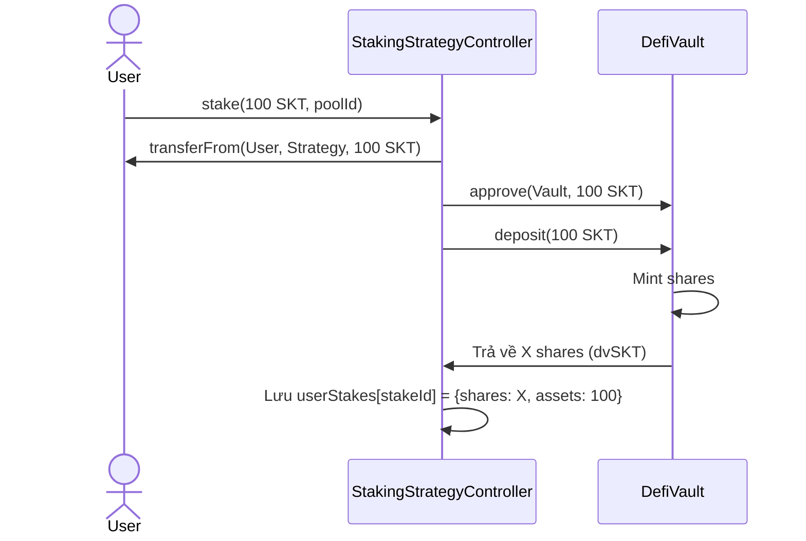
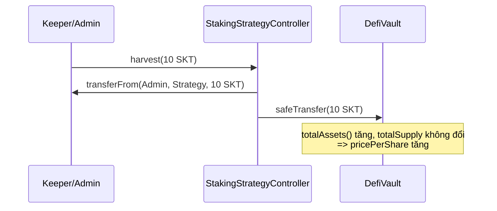
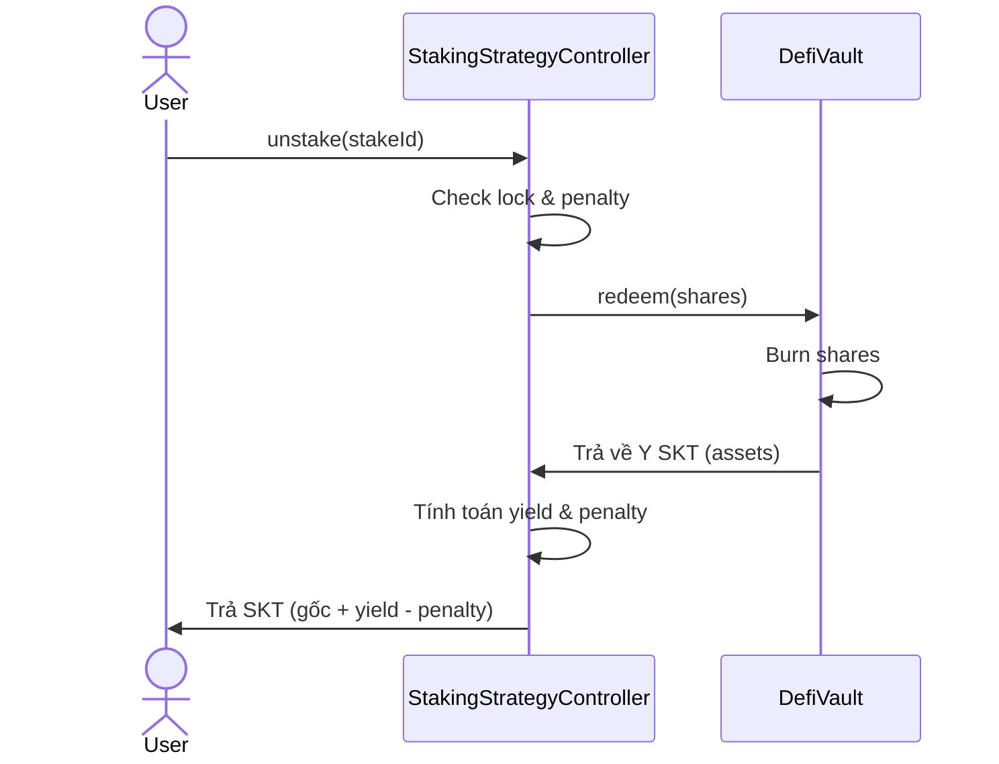
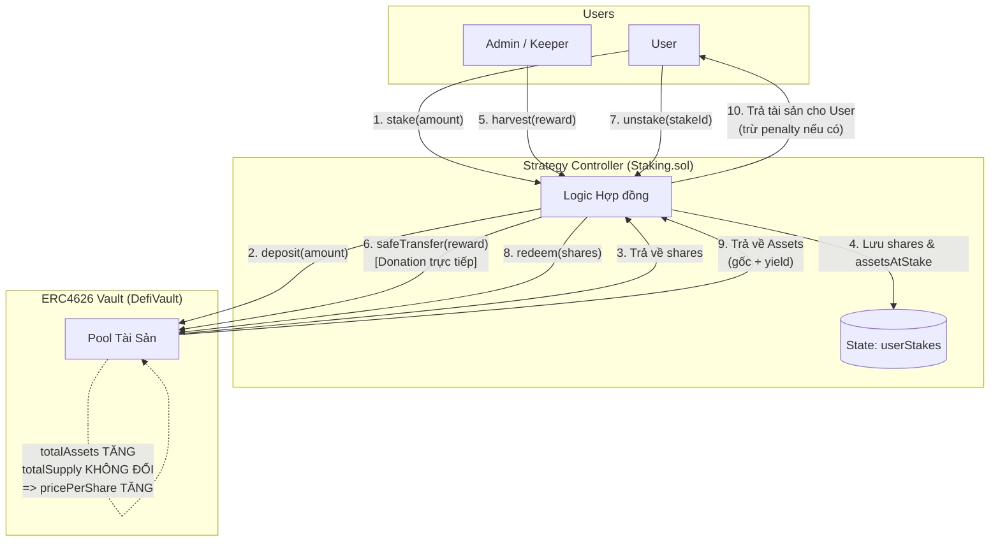

# Phương hướng tích hợp StakingStrategyController → DefiVault (ERC4626)

**Đề tài:** Nghiên cứu các giao thức DeFi trên Blockchain và phát triển ứng dụng WebDefi thử nghiệm trên Ethereum Sepolia  
**Phạm vi:** Tài liệu kiến trúc và luồng tích hợp giữa `StakingStrategyController` (Strategy) và `DefiVault` (ERC4626 Vault)  
**Trạng thái:** Đã hoàn thành (Phase 5)

---

## 1. Bối cảnh & Mục tiêu

Sau khi hoàn thiện `DefiVault` đạt chuẩn ERC4626, bài toán đặt ra là chuyển đổi mô hình Staking cũ (`WalletStaking` - trả lãi cố định APR, tĩnh) sang một mô hình sinh lời thực tế (Dynamic Yield).
Mục tiêu: Xây dựng một **Strategy Controller** kết nối với **DefiVault**, trong đó:
- **Vault** quản lý `shares` (chứng nhận cổ phần) và tài sản tổng.
- **Strategy** xử lý logic stake/unstake, thời gian khóa (lock duration), và penalty của người dùng.
- Yield (lợi nhuận) được tạo ra thông qua cơ chế `harvest()` (tiêm lợi nhuận vào Vault, làm tăng `pricePerShare`).

---

## 2. Mô hình kiến trúc: "Strategy → Vault"

```text
User -- stake(SKT) --> StakingStrategyController (Strategy)
                                |
                                v (deposit)
                           DefiVault (ERC4626)
                                |
                                v
                       Strategy nhận dvSKT (Shares)
```

Trong mô hình này:
- **`DefiVault`**: Nắm giữ tài sản thực tế và quản lý tỷ giá `pricePerShare`. Không quan tâm đến thời hạn hay penalty (Core Accounting).
- **`StakingStrategyController`**: Đóng vai trò là **Strategy**. Nó nhận SKT từ User, gọi `vault.deposit()` để gửi vào Vault, sau đó lưu lại `shares` cho mỗi User thay vì lưu balance tĩnh.
- **Người dùng**: Tương tác trực tiếp với Strategy để Stake/Unstake.

---

## 3. Luồng nghiệp vụ chi tiết

### A. Luồng Stake (User → Strategy → Vault)



1. User gọi `stake(100 SKT)` vào `Strategy`.
2. Strategy nhận tiền từ User, cấp quyền (approve) cho Vault.
3. Strategy gọi `deposit(100)` vào `DefiVault`.
4. Vault mint `shares` (dvSKT) trả về cho Strategy.
5. Strategy ghi nhận số `shares` này vào vị thế (position) của User.

### B. Luồng Harvest (Sinh lời tự động)



1. Admin/Keeper (đóng vai trò nguồn tạo ra yield) gọi `harvest(rewardAmount)` trên `Strategy`.
2. Token được đẩy **trực tiếp** vào địa chỉ của `DefiVault` thông qua `transfer()`.
3. Hành động này là **Donation** (Realized Gain). Nó làm tăng `totalAssets()` của Vault nhưng **không mint thêm shares**.
4. Kết quả: Tất cả các `shares` đang tồn tại (của stakers) đều tự động tăng giá trị quy đổi sang SKT.

> **Lưu ý (Về bản chất của Harvest):** Trong kiến trúc này, `harvest` chính là cơ chế **trả reward (lợi nhuận/yield)** cho những người đang staking. Thay vì cập nhật số dư cho từng cá nhân (như mô hình Fixed APR cũ), `harvest` bơm trực tiếp token vào két (Vault). Hành động này tự động làm tăng giá trị cổ phần (`pricePerShare`). Khi người dùng `unstake` và quy đổi `shares` ra token gốc, họ sẽ nhận được nhiều token hơn số lượng nạp vào ban đầu. Phần chênh lệch đó chính là phần thưởng (Reward) của họ.

### C. Luồng Unstake (User → Strategy → Vault)



1. User gọi `unstake(stakeId)` trên `Strategy`.
2. Strategy kiểm tra `shares` tương ứng của vị thế.
3. Strategy gọi `vault.redeem(shares)` để rút tài sản từ Vault. Do `pricePerShare` đã tăng nhờ quá trình Harvest, tài sản thu về (Y) sẽ lớn hơn hoặc bằng gốc ban đầu (100).
4. Strategy tính yield: `Y - 100`.
5. Strategy tính penalty (nếu rút sớm) dựa trên gốc ban đầu.
6. Strategy chuyển tài sản cuối cùng về cho User.

---

## 4. Các giải pháp Kỹ thuật và Bảo mật

### 4.1 State Management (Shares vs Assets)
Strategy **không lưu** số lượng assets sinh lời hiện tại của người dùng. Nó chỉ lưu `shares` và `assetsAtStake` (gốc snapshot ban đầu). Giá trị thực tế của vị thế được tính toán động (dynamic) bằng cách gọi `vault.previewRedeem(shares)`.

### 4.2 CEI Pattern & ReentrancyGuard
Để phòng chống **Reentrancy**:
- State của User (`shares`, `assetsAtStake`, `totalStaked`) được xoá/cập nhật **trước khi** gọi external call `vault.redeem()`.
- Sử dụng modifier `nonReentrant` trên toàn bộ các hàm state-changing.
- (Slither Static Analysis đã quét và chứng nhận an toàn, không có vector tấn công Reentrancy).

### 4.3 Quản lý Penalty an toàn
Penalty được tính dựa trên **Principal Snapshot** (`assetsAtStake`) chứ không phải giá trị assets động. Nếu Vault gặp rủi ro giảm giá trị (loss), thuật toán được thiết kế để chặn (cap) penalty tối đa bằng số assets thực thu về, ngăn chặn tuyệt đối lỗi `underflow` toán học.

---

### 4.4 Công thức Tính toán Lợi nhuận và Phí phạt trong Staking.sol

Trong mô hình Strategy-Based Vault, thay vì tính lãi tĩnh theo thời gian (như `WalletStaking.sol`), lợi nhuận được tính linh động thông qua giá trị của `Shares` tại thời điểm rút.

1.  **Công thức tính Lợi nhuận (Yield):**
    Khi User gọi `unstake`, Strategy sẽ gọi `vault.redeem(shares)` để lấy lại tài sản. Lợi nhuận được sinh ra do tỷ giá `pricePerShare` tăng lên nhờ quá trình `harvest()` (tiêm thêm token phần thưởng vào Vault).
    - Lượng tài sản thực nhận: $Assets_{Returned} = Vault.redeem(Shares_{User})$
    - Lợi nhuận sinh ra: $Yield = \max(0, Assets_{Returned} - Assets_{AtStake})$
    *(Trong đó $Assets_{AtStake}$ là số tiền gốc ban đầu User gửi vào)*

2.  **Công thức tính Phí phạt (Penalty):**
    Phí phạt (nếu User rút trước hạn) được tính toán dựa trên **giá trị gốc ban đầu** ($Assets_{AtStake}$) thay vì tổng giá trị tài sản hiện tại. Điều này nhằm đảm bảo User không bị phạt lạm vào phần yield một cách bất hợp lý.
    - Phí phạt thô: $RawPenalty = \frac{Assets_{AtStake} \times PenaltyRate}{10000}$
    - Phí phạt thực tế (được giới hạn trần - Cap): $Penalty = \min(RawPenalty, Assets_{Returned})$
    *(Việc cap giới hạn penalty ở mức tối đa bằng $Assets_{Returned}$ giúp ngăn chặn hoàn toàn lỗi underflow toán học trong trường hợp Vault bị suy giảm (loss) khiến giá trị trả về nhỏ hơn số tiền phạt).*

3.  **Công thức Tính lượng Assets chờ nhận (Pending Yield):**
    Để hiển thị cho người dùng lượng lãi đang tạm tính mà không cần thực hiện thao tác rút, hàm `getPendingYield` sử dụng `vault.previewRedeem`:
    - Giá trị hiện hành: $CurrentValue = Vault.previewRedeem(Shares_{User})$
    - Lãi tạm tính: $PendingYield = \max(0, CurrentValue - Assets_{AtStake})$

### 4.5 Chi tiết Kiến trúc Hoạt động trong Staking.sol (Strategy-Based Vault)

Dựa trên bản thiết kế tại `implementation_plan.md`, `Staking.sol` đóng vai trò là một **Strategy Controller** tuân thủ chuẩn giao tiếp `IStrategy`. 

**Sơ đồ Trực quan hóa Kiến trúc Tổng thể:**



Cách hoạt động cốt lõi bao gồm:

- **Tách biệt Kế toán và Tài sản:** `Staking.sol` KHÔNG trực tiếp nắm giữ tài sản của người dùng. Ngay khi `stake()` được gọi, token được luân chuyển thẳng vào `DefiVault` (`vault.deposit`), và `Staking.sol` nhận lại lượng `shares` tương ứng. Tất cả quy trình kế toán nội bộ của `Staking.sol` (`userStakes`) đều ghi nhận vị thế bằng `shares` này thay vì lượng token vật lý.
- **Cơ chế Harvest (Tạo Yield Động):** Hàm `harvest()` trong `Staking.sol` không gọi hàm `vault.deposit()` thông thường vì điều đó sẽ đúc (mint) thêm `shares` mới và làm hỏng tỷ lệ kế toán. Thay vào đó, nó sử dụng cơ chế **Donate / Realized Gain**: token phần thưởng được chuyển (`safeTransfer`) trực tiếp vào địa chỉ của hợp đồng `DefiVault`. Hành động quyên góp này làm tăng `totalAssets()` của Vault nhưng giữ nguyên `totalSupply()` (tổng lượng shares), từ đó gián tiếp làm tăng tỷ giá `pricePerShare` cho tất cả người nắm giữ shares.
- **Quản lý Rủi ro & Đồng bộ Trạng thái:** Biến `totalDeployedToVault` trong `Staking.sol` chỉ được sử dụng để theo dõi (tracking) lượng tiền gốc đang hoạt động. Nó có thể có sai lệch (drift) so với `vault.totalAssets()` do vault có thể tích lũy yield từ các đợt harvest. Mọi tính toán tài chính thực tế để trả về cho người dùng đều hoàn toàn dựa trên `previewRedeem` và việc tương tác trực tiếp với Vault.

---

## 5. Đánh giá Kiến trúc và So sánh Chi tiết: Staking.sol vs WalletStaking.sol

Để làm nổi bật giá trị của kiến trúc mới, dưới đây là bảng so sánh chi tiết giữa phiên bản cũ (`WalletStaking.sol`) và kiến trúc Strategy-Based Vault (`Staking.sol`), đặc biệt chú trọng về khía cạnh hiệu suất và chi phí gas, phục vụ trực tiếp cho báo cáo của đề tài NCKH.

| Tiêu chí | `WalletStaking.sol` (Baseline Cũ) | `Staking.sol` + `DefiVault` (Kiến trúc Mới) |
| --- | --- | --- |
| **Mô hình Lợi nhuận (Yield)** | **Cố định (Fixed APR):** Lãi tính bằng công thức thời gian tĩnh (`apr * time / 365`). Có nguy cơ cao gây ra lạm phát token nội bộ nếu phần thưởng không được cấp đủ. | **Động (Dynamic Yield):** Sinh lời thực tế dựa vào sự tăng trưởng của Vault thông qua các chiến lược đầu tư (`harvest`), bảo vệ giao thức khỏi lạm phát ảo. |
| **Bản chất Kế toán** | **Amount-based:** Lưu trữ số lượng token gốc tĩnh `amount`. Lãi được cộng thêm khi user thực hiện claim. | **Share-based:** Lưu trữ vị thế bằng `shares` của Vault (chuẩn ERC4626). Tỷ giá quy đổi `token/shares` luôn dao động theo thời gian thực. |
| **Vị trí lưu trữ Tài sản** | Toàn bộ tài sản bị khóa cứng trong chính contract `WalletStaking`. | Tài sản được luân chuyển tập trung về một **Két sắt (Vault)** chung. Mở ra tiềm năng tái đầu tư chéo (composability). |
| **Tính Mở rộng (Composability)** | **Kín (Silo):** Độc lập, không có tính kết nối với hệ sinh thái DeFi rộng lớn bên ngoài. | **Mở (Plug-and-play):** Dễ dàng cắm vào các giao thức DeFi chuẩn hóa khác (ví dụ: Yearn, Morpho, Aave) nhờ tuân thủ triệt để chuẩn ERC4626. |
| **Bảo mật & Rủi ro Toán học** | Thấp gọn nhẹ, tuy nhiên việc quản lý chung (Gốc + Lãi) trong cùng một hợp đồng dễ dẫn đến rủi ro cạn kiệt thanh khoản quỹ thưởng (Reward pool drain). | **Cách ly rủi ro:** `Staking.sol` chỉ tập trung quản lý quy tắc khóa/phạt, trong khi `DefiVault` chuyên biệt bảo vệ tài sản. Giải quyết triệt để vấn đề Underflow/Overflow bằng các cơ chế chặn trần (cap). |
| **Hiệu suất / Chi phí Gas (Gas Cost)** | **Rất Thấp / Rẻ:** Tính toán đơn giản bằng toán học cục bộ bên trong một hợp đồng duy nhất. Ít các cuộc gọi ngoại lai (external calls). | **Cao hơn (khoảng 50-70%):** Do hợp đồng phải thực hiện nhiều lời gọi liên hợp đồng (Cross-Contract calls) sang Vault để thực thi `deposit`, `redeem`, `previewRedeem`. Tuy nhiên, đây là sự đánh đổi hoàn toàn xứng đáng cho một kiến trúc module hóa và bảo mật cấp doanh nghiệp. |
| **Mức độ phù hợp NCKH** | Thấp, cấu trúc quá đơn giản, chỉ phù hợp làm baseline cơ sở để đối chiếu. Thiếu vắng các khái niệm Web3 nâng cao. | **Rất cao**, mô hình này thể hiện rõ ràng và đầy đủ các khái niệm tiên tiến nhất của DeFi hiện đại như: Yield Strategies, Tokenized Vaults, Real Yield, CEI Patterns. |

---

## 6. Đánh Giá Toàn Diện (Strategy-Vault vs Legacy WalletStaking)

Bảng dưới đây so sánh toàn diện giữa kiến trúc Staking mới (`StakingStrategyController` + `DefiVault`) so với Staking gốc (`WalletStaking`) dựa trên các số liệu thực tế đã kiểm thử. Đây là dữ liệu quan trọng phục vụ cho nghiên cứu khoa học (NCKH).

| Tiêu chí đánh giá | Staking Mới (Strategy-Vault) | Staking Gốc (Legacy WalletStaking) | Đánh giá / Phân tích |
|---|---|---|---|
| **1. Nguồn tạo Lợi nhuận** | **Động (Dynamic Yield):** Từ `DefiVault` thông qua tăng trưởng `pricePerShare`. Phụ thuộc vào lợi nhuận thực tế (realized gains) được inject qua `harvest()`. | **Cố định (Fixed APR):** Tính toán off-chain dựa trên công thức tĩnh $\frac{APR \times time}{365}$. | **Mới tốt hơn:** Lợi nhuận thực tế, không lạm phát ảo. Phản ánh đúng mô hình tài chính DeFi. |
| **2. Quản lý Tài sản** | Token được đẩy thẳng vào `DefiVault`. Strategy (`Staking.sol`) chỉ giữ **Shares** (chứng nhận cổ phần). | Token nằm chết (idle) trong contract `WalletStaking.sol`. | **Mới tốt hơn:** Tối ưu hiệu quả sử dụng vốn (Capital Efficiency). Vault có thể đem token đi đầu tư tiếp. |
| **3. Quy trình Stake** | User $\rightarrow$ Strategy $\rightarrow$ Vault $\rightarrow$ Shares $\rightarrow$ Lưu `StakeInfo` | User $\rightarrow$ Contract $\rightarrow$ Lưu `amount` vào `StakeInfo` | **Gốc đơn giản hơn:** Mới yêu cầu nhiều bước cross-contract hơn (approve, deposit). |
| **4. Phí Gas (stake)** | ~ 347,064 gas | ~ 230,963 gas | **Gốc rẻ hơn:** Mới đắt hơn ~50.2% do phải tính toán mint shares và cập nhật state ở cả 2 contract. |
| **5. Phí Gas (unstake)** | ~ 117,840 gas (không yield) <br> ~ 119,254 gas (có yield) | ~ 68,856 gas | **Gốc rẻ hơn:** Mới đắt hơn ~71% do phải tính toán redeem shares sang assets. |
| **6. Rủi ro Bảo mật tĩnh** | Cần chặn **Reentrancy** kỹ lưỡng (đã áp dụng CEI + `nonReentrant`). Rủi ro Same-block sandwich attack đã được Vault handle. | Rủi ro cạn kiệt pool thưởng (Reward Pool drain) nếu admin không nạp đủ token. | **Mới an toàn hơn:** Tách biệt rõ ràng rủi ro sinh lời (Vault) và rủi ro sổ cái (Strategy). |
| **7. Khả năng Mở rộng** | **Rất cao (High Composability):** Chuẩn ERC4626 cho phép tích hợp dễ dàng với Yearn, Aave, Compound. | **Thấp (Siloed):** Contract đóng, không theo chuẩn, khó kết hợp với các giao thức khác. | **Mới tốt hơn:** Đạt chuẩn công nghiệp Web3. |
| **8. Thông số / Tham số** | - `shares`: Đại diện principal + yield<br>- `assetsAtStake`: Dùng tính penalty<br>- `totalHarvested`: Tổng lợi nhuận sinh ra | - `amount`: Tiền gốc<br>- `rewardPoolBalance`: Quỹ thưởng<br>- `lastClaimAt`: Lần nhận thưởng cuối | **Mới tốt hơn:** Kế toán (accounting) qua `shares` là phương pháp an toàn và chính xác nhất cho Vault. |

---

### Tổng kết
Kiến trúc **Strategy-Vault (Mới)** đánh đổi chi phí Gas đắt hơn khoảng **50% - 70%** để đổi lấy **hiệu quả sử dụng vốn (capital efficiency)**, **tính minh bạch sinh lời (realized yield)** và **khả năng tương tác (composability)** theo chuẩn ERC4626. Sự đánh đổi này là hoàn toàn xứng đáng và phản ánh chính xác xu hướng tiến hóa của các giao thức DeFi hiện đại (như Yearn V3).

